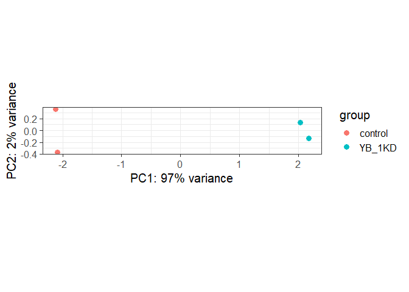
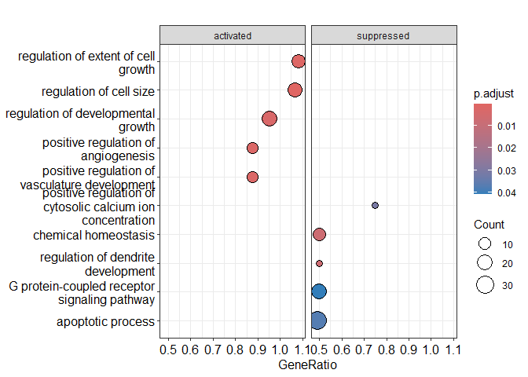

Glioblastoma_Bulk_RNAseq_Analysis
================

## Objectives

### Gene expression profiling study by RNA-seq in glioblastoma cell lines using data from the journal article “Upregulated YB-1 protein promotes glioblastoma growth through a YB-1/CCT4/mLST8/mTOR pathway.”

### Wang et al., 2022 J Clin Invest 132:e146536

### YB-1 is a cold shock domain (CSD)-containing RNA binding protein. It is involved in virtually all steps of RNA metabolism. In this study, we detected the gene expression profiles of control or YB-1 knockdown in U251 and U87 cells by performing high-throughput RNA sequencing.

### RNA-seq was performed from U251 cells expressing control- or YB-1-specific shRNAs. RNA-seq was performed from U87 cells expressing control- or YB-1-specific shRNAs.

## Data

### Raw data is accessible from GEO with the following accession code: GSE161523

## Setup

``` r
pacman::p_load(tidyverse, readxl, openxlsx, janitor, ggrepel, stringi, ggvenn,
               edgeR, DESeq2, EnhancedVolcano, pheatmap, clusterProfiler,
               org.Hs.eg.db, AnnotationDbi, conflicted)
conflict_prefer("filter", "dplyr") 
```

    ## [conflicted] Will prefer dplyr::filter over any other package.

``` r
conflict_prefer("select", "dplyr")
```

    ## [conflicted] Will prefer dplyr::select over any other package.

``` r
conflict_prefer("setdiff", "dplyr")
```

    ## [conflicted] Will prefer dplyr::setdiff over any other package.

``` r
conflict_prefer("rename", "dplyr")
```

    ## [conflicted] Will prefer dplyr::rename over any other package.

``` r
rm(list=ls())
```

## Read in counts

``` r
## count matrix ##
counts_U251 <- read_delim("./data/GSE161523_all_sample_read.count.tsv",
                          na = c("", "NA")) %>% 
  column_to_rownames("...1") 
```

    ## New names:
    ## Rows: 60676 Columns: 5
    ## ── Column specification
    ## ──────────────────────────────────────────────────────── Delimiter: "\t" chr
    ## (1): ...1 dbl (4): shluc1, shluc2, shY1, shY2
    ## ℹ Use `spec()` to retrieve the full column specification for this data. ℹ
    ## Specify the column types or set `show_col_types = FALSE` to quiet this message.
    ## • `` -> `...1`

``` r
counts_U87  <- read_delim("./data/GSE161523_U87_all_sample_read.count.tsv",
                          na = c("", "NA")) %>% 
  column_to_rownames("...1") 
```

    ## New names:
    ## Rows: 60676 Columns: 5
    ## ── Column specification
    ## ──────────────────────────────────────────────────────── Delimiter: "\t" chr
    ## (1): ...1 dbl (4): shLuc_1, shLuc_2, shY1_1, shY1_2
    ## ℹ Use `spec()` to retrieve the full column specification for this data. ℹ
    ## Specify the column types or set `show_col_types = FALSE` to quiet this message.
    ## • `` -> `...1`

``` r
## Pre-filtering only in U87 ##
n_expressed_U87 <- rowSums(counts_U87 > 0)
sum(n_expressed_U87==0)    # non expressing genes = 32432
```

    ## [1] 32432

``` r
ggplot(data.frame(n_expressed_U87), aes(x=n_expressed_U87)) +
  geom_bar() +
  labs(x="Number of samples expressed in", y="Number of genes") +
  theme_bw(base_size = 20)
```

<!-- -->

``` r
counts_U87_pf <- counts_U87[ n_expressed_U87 > 0,]   # Gene Number = 28244
dim(counts_U87_pf) # 28244 4
```

    ## [1] 28244     4

## Sample annotation

``` r
## sample information(coldata) ##
sample_ann_U251 <- as.data.frame(t(counts_U251))　%>% 
  mutate(Group=row.names(.)) %>%
  select(Group) %>% 
  mutate(Group = str_sub(Group, 1, str_length(Group)-1)) 

sample_ann_U251$Group <-
  stri_replace_all_regex(sample_ann_U251$Group,
                         pattern=c("shluc","shY"),
                         replacement=c("control","YB_1KD"),
                         vectorize_all=FALSE) 

sample_ann_U87 <- as.data.frame(t(counts_U87_pf))　%>% 
  mutate(Group=row.names(.)) %>%
  select(Group) %>% 
  mutate(Group = str_sub(Group, 1, str_length(Group)-2)) 

sample_ann_U87$Group <-
  stri_replace_all_regex(sample_ann_U87$Group,
                         pattern=c("shLuc","shY1"),
                         replacement=c("control","YB_1KD"),
                         vectorize_all=FALSE)
```

## Q1. Generate DESeq2 object using column/count data and make a PCA plot using normalised count data.

## Are control and YB_1 KD samples separated on the PCA plot?

``` r
identical( colnames(counts_U251), rownames(sample_ann_U251) )

all(colnames(counts_U87_pf) %in% rownames(sample_ann_U87))


dds_U251 <- DESeqDataSetFromMatrix(countData = round(counts_U251),
                                   colData = sample_ann_U251,
                                   design = ~ Group)
```

    ## converting counts to integer mode

    ## Warning in DESeqDataSet(se, design = design, ignoreRank): some variables in
    ## design formula are characters, converting to factors

``` r
assay(dds_U251)[ 1:3, 1:4]

cpm(dds_U251)[1:3, 1:4]

cpm(dds_U251) %>% colSums() %>% head()

colData(dds_U251)[1:3, ]

rowData(dds_U251)[1:3, ]

dim(dds_U251) # 60676  4

save(dds_U251, file="./data/data_U251_clean.rda", compress=TRUE)

dds_U87 <- DESeqDataSetFromMatrix(countData = round(counts_U87_pf),
                                  colData = sample_ann_U87,
                                  design = ~ Group)
```

    ## converting counts to integer mode

    ## Warning in DESeqDataSet(se, design = design, ignoreRank): some variables in
    ## design formula are characters, converting to factors

``` r
assay(dds_U87)[ 1:3, 1:4]

cpm(dds_U87)[1:3, 1:4]

cpm(dds_U87) %>% colSums() %>% head()

colData(dds_U87)[1:3, ]

rowData(dds_U87)[1:3, ]

dim(dds_U87) # 28244  4

save(dds_U87, file="./data/data_U87_clean.rda", compress=TRUE)
```

## VST expression (Variable stabilizing)

### U251

``` r
vst_U251_expr <- vst(dds_U251, blind=FALSE)
norm_U251_count <- assay(vst_U251_expr)

write.csv(norm_U251_count,"./results/normalized_counts_U251.csv", row.names = TRUE) 
```

## PCA

``` r
plotPCA(vst_U251_expr, intgroup="Group") + 
  theme_bw(base_size=15)
```

    ## using ntop=500 top features by variance

<!-- -->
\### U87

``` r
vst_U87_expr <- vst(dds_U87, blind=FALSE)
norm_U87_count <- assay(vst_U87_expr)

write.csv(norm_U87_count,"./results/normalized_counts_U87.csv", row.names = TRUE) 
```

## PCA

``` r
plotPCA(vst_U87_expr, intgroup="Group") + 
  theme_bw(base_size=15)
```

    ## using ntop=500 top features by variance

<!-- -->

## DIFFERENTIAL GENE EXPRESSION

### Q2. Find differentially expressed genes (DEGs) between Control and YB-1 knockdown cell lines

``` r
# U251

dds_U251 <- DESeq(dds_U251)
```

    ## estimating size factors

    ## estimating dispersions

    ## gene-wise dispersion estimates

    ## mean-dispersion relationship

    ## final dispersion estimates

    ## fitting model and testing

``` r
res_U251 <- results(dds_U251, 
                    contrast=c("Group", "YB_1KD", "control")) %>% 
                    data.frame()
resordered_U251 <- arrange(res_U251, padj)
write.csv(resordered_U251, file="./results/DESeq2_u251.csv")


# U87

dds_U87 <- DESeq(dds_U87)
```

    ## estimating size factors

    ## estimating dispersions

    ## gene-wise dispersion estimates

    ## mean-dispersion relationship

    ## -- note: fitType='parametric', but the dispersion trend was not well captured by the
    ##    function: y = a/x + b, and a local regression fit was automatically substituted.
    ##    specify fitType='local' or 'mean' to avoid this message next time.

    ## final dispersion estimates

    ## fitting model and testing

``` r
res_U87 <- results(dds_U87, 
                   contrast=c("Group", "YB_1KD", "control")) %>% 
                   data.frame()  
resordered_U87 <- arrange(res_U87, padj)
write.csv(resordered_U87, file="./results/DESeq2_u87.csv")
```

## Q3. Make a volcano plot of up and down-regulated genes.

### U251

``` r
res_U251 <- read_delim("./results/DESeq2_u251.csv")
```

    ## New names:
    ## Rows: 60676 Columns: 7
    ## ── Column specification
    ## ──────────────────────────────────────────────────────── Delimiter: "," chr
    ## (1): ...1 dbl (6): baseMean, log2FoldChange, lfcSE, stat, pvalue, padj
    ## ℹ Use `spec()` to retrieve the full column specification for this data. ℹ
    ## Specify the column types or set `show_col_types = FALSE` to quiet this message.
    ## • `` -> `...1`

``` r
res_U251$Legend = case_when(res_U251$padj<=1e-05 & abs(res_U251$log2FoldChange)>=1 ~ "Significant & Fold Change",
                           res_U251$padj<=1e-05 ~ "Significant",
                           abs(res_U251$log2FoldChange)>=1 ~ "Fold Change",
                           TRUE ~ "Non-significant")
extract_U251 <- res_U251 %>%
  filter(Legend == "Significant & Fold Change") %>% 
  rename("ENSEMBL" = "...1")

p <- ggplot(res_U251, aes(log2FoldChange, -log10(padj))) +
  geom_point(aes(col=Legend), position=position_jitter(h=0.15,w=0.15)) +
  scale_color_manual(values=c("Significant & Fold Change"="red",
                              "Significant"="#a18f80",
                              "Fold Change"="grey",
                              "Non-significant"="black")) +
  xlab(expression(paste("Log"[2]," (Fold Change)"))) +
  ylab(expression(paste("-Log"[10]," (p Value)"))) +
  ggtitle("Volcano plot U251") +
  theme(plot.title = element_text(hjust = 0.5)) +
  theme_bw() +
  geom_hline(yintercept = 3, linetype = 2, colour = "red") +
  geom_vline(xintercept = 1, linetype = 2, colour = "red") +
  geom_vline(xintercept = -1, linetype = 2, colour = "red")

gene_ann_U251 <- data.frame(ENSEMBL=res_U251$...1)
map <- bitr(gene_ann_U251$ENSEMBL, 
            fromType="ENSEMBL", 
            toType=c("SYMBOL","GENENAME"), 
            OrgDb="org.Hs.eg.db")
```

    ## 'select()' returned 1:many mapping between keys and columns

``` r
colnames(res_U251)[1 ] <- "ENSEMBL"
res_U251 <- left_join(res_U251, map) 
```

    ## Joining with `by = join_by(ENSEMBL)`

``` r
genes_to_plot_U251 <- res_U251 %>% 
  filter (abs(log2FoldChange) >1 & -log10(padj) >50)

p + geom_label_repel(data = genes_to_plot_U251,   
                     aes(label = SYMBOL),
                     force = 2,
                     nudge_y = 1)
```

<!-- -->

### U87

``` r
res_U87 <- read_delim("./results/DESeq2_u87.csv")
```

    ## New names:
    ## Rows: 28244 Columns: 7
    ## ── Column specification
    ## ──────────────────────────────────────────────────────── Delimiter: "," chr
    ## (1): ...1 dbl (6): baseMean, log2FoldChange, lfcSE, stat, pvalue, padj
    ## ℹ Use `spec()` to retrieve the full column specification for this data. ℹ
    ## Specify the column types or set `show_col_types = FALSE` to quiet this message.
    ## • `` -> `...1`

``` r
res_U87$Legend = case_when(res_U87$padj<=1e-05 & abs(res_U87$log2FoldChange)>=1 ~ "Significant & Fold Change",
                           res_U87$padj<=1e-05 ~ "Significant",
                           abs(res_U87$log2FoldChange)>=1 ~ "Fold Change",
                           TRUE ~ "Non-significant")
extract_U87 <- res_U87 %>%
  filter(Legend == "Significant & Fold Change") %>% 
  rename("ENSEMBL" = "...1")

p <- ggplot(res_U87, aes(log2FoldChange, -log10(padj))) +
  geom_point(aes(col=Legend), position=position_jitter(h=0.15,w=0.15)) +
  scale_color_manual(values=c("Significant & Fold Change"="red",
                              "Significant"="#a18f80",
                              "Fold Change"="grey",
                              "Non-significant"="black")) +
  xlab(expression(paste("Log"[2]," (Fold Change)"))) +
  ylab(expression(paste("-Log"[10]," (p Value)"))) +
  ggtitle("Volcano plot U87") +
  theme(plot.title = element_text(hjust = 0.5)) +
  theme_bw() +
  geom_hline(yintercept = 3, linetype = 2, colour = "red") +
  geom_vline(xintercept = 1, linetype = 2, colour = "red") +
  geom_vline(xintercept = -1, linetype = 2, colour = "red")

gene_ann_U87 <- data.frame(ENSEMBL=res_U87$...1)
map <- bitr(gene_ann_U87$ENSEMBL, 
            fromType="ENSEMBL", 
            toType=c("SYMBOL","GENENAME"), 
            OrgDb="org.Hs.eg.db")
```

    ## 'select()' returned 1:many mapping between keys and columns

``` r
colnames(res_U87)[1 ] <- "ENSEMBL"
res_U87 <- left_join(res_U87, map) 
```

    ## Joining with `by = join_by(ENSEMBL)`

``` r
genes_to_plot_U87 <- res_U87 %>% 
  filter (abs(log2FoldChange) >1 & -log10(padj) >50)

p + geom_label_repel(data = genes_to_plot_U87,   
                     aes(label = SYMBOL),
                     force = 2,
                     nudge_y = 1)
```

<!-- -->

## PATHWAY ENRICHMENT ANALYSIS

### Q4. What are the top up and down regulated pathways?

### U251

``` r
tum_ranked_U251 <- read_csv("./results/DESeq2_u251.csv") %>% 
  rename("ENSEMBL" = "...1") %>% 
  filter(abs(log2FoldChange)>1 & padj<0.05)
```

    ## New names:
    ## Rows: 60676 Columns: 7
    ## ── Column specification
    ## ──────────────────────────────────────────────────────── Delimiter: "," chr
    ## (1): ...1 dbl (6): baseMean, log2FoldChange, lfcSE, stat, pvalue, padj
    ## ℹ Use `spec()` to retrieve the full column specification for this data. ℹ
    ## Specify the column types or set `show_col_types = FALSE` to quiet this message.
    ## • `` -> `...1`

``` r
gene_ann <- data.frame(SYMBOL=tum_ranked_U251$ENSEMBL)
map <- bitr(gene_ann$SYMBOL, fromType="ENSEMBL", toType=c("SYMBOL","GENENAME"), OrgDb="org.Hs.eg.db")
```

    ## 'select()' returned 1:many mapping between keys and columns

    ## Warning in bitr(gene_ann$SYMBOL, fromType = "ENSEMBL", toType = c("SYMBOL", :
    ## 7.59% of input gene IDs are fail to map...

``` r
tum_ranked_U251 <- tum_ranked_U251 %>% full_join(map) 
```

    ## Joining with `by = join_by(ENSEMBL)`

``` r
original_gene_list_U251 <- tum_ranked_U251$log2FoldChange
names(original_gene_list_U251) <- tum_ranked_U251$ENSEMBL
gene_list_U251 <- na.omit(original_gene_list_U251)
gene_list_U251 = sort(gene_list_U251, decreasing = TRUE)

gse_U251_1 <- gseGO(geneList=gene_list_U251, 
                    ont ="BP", 
                    keyType = "ENSEMBL", 
                    minGSSize = 3, 
                    maxGSSize = 800, 
                    pvalueCutoff = 0.05, 
                    verbose = TRUE, 
                    OrgDb = org.Hs.eg.db, 
                    pAdjustMethod = "none")
```

    ## preparing geneSet collections...
    ## GSEA analysis...

    ## Warning in preparePathwaysAndStats(pathways, stats, minSize, maxSize, gseaParam, : There are ties in the preranked stats (1.46% of the list).
    ## The order of those tied genes will be arbitrary, which may produce unexpected results.

    ## Warning in preparePathwaysAndStats(pathways, stats, minSize, maxSize,
    ## gseaParam, : There are duplicate gene names, fgsea may produce unexpected
    ## results.

    ## Warning in fgseaMultilevel(pathways = pathways, stats = stats, minSize =
    ## minSize, : There were 5 pathways for which P-values were not calculated
    ## properly due to unbalanced (positive and negative) gene-level statistic values.
    ## For such pathways pval, padj, NES, log2err are set to NA. You can try to
    ## increase the value of the argument nPermSimple (for example set it nPermSimple
    ## = 10000)

    ## Warning in fgseaMultilevel(pathways = pathways, stats = stats, minSize =
    ## minSize, : For some of the pathways the P-values were likely overestimated. For
    ## such pathways log2err is set to NA.

    ## leading edge analysis...
    ## done...

``` r
dotplot(gse_U251_1, showCategory=5, split=".sign") + facet_grid(.~.sign)
```

<!-- -->

### U87

``` r
tum_ranked_U87 <- read_csv("./results/DESeq2_u87.csv") %>% 
  rename("ENSEMBL" = "...1") %>% 
  filter(abs(log2FoldChange)>1 & padj<0.05)
```

    ## New names:
    ## Rows: 28244 Columns: 7
    ## ── Column specification
    ## ──────────────────────────────────────────────────────── Delimiter: "," chr
    ## (1): ...1 dbl (6): baseMean, log2FoldChange, lfcSE, stat, pvalue, padj
    ## ℹ Use `spec()` to retrieve the full column specification for this data. ℹ
    ## Specify the column types or set `show_col_types = FALSE` to quiet this message.
    ## • `` -> `...1`

``` r
gene_ann <- data.frame(SYMBOL=tum_ranked_U87$ENSEMBL)
map <- bitr(gene_ann$SYMBOL, fromType="ENSEMBL", toType=c("SYMBOL","GENENAME"), OrgDb="org.Hs.eg.db")
```

    ## 'select()' returned 1:many mapping between keys and columns

    ## Warning in bitr(gene_ann$SYMBOL, fromType = "ENSEMBL", toType = c("SYMBOL", :
    ## 12.88% of input gene IDs are fail to map...

``` r
tum_ranked_U87 <- tum_ranked_U87 %>% full_join(map) 
```

    ## Joining with `by = join_by(ENSEMBL)`

``` r
original_gene_list <- tum_ranked_U87$log2FoldChange
names(original_gene_list) <- tum_ranked_U87$ENSEMBL
gene_list <- na.omit(original_gene_list)
gene_list = sort(gene_list, decreasing = TRUE)

gse_U87_1 <- gseGO(geneList=gene_list, 
              ont ="BP", 
              keyType = "ENSEMBL", 
              nPerm = 10000, 
              minGSSize = 3, 
              maxGSSize = 800, 
              pvalueCutoff = 0.05, 
              verbose = TRUE, 
              OrgDb = org.Hs.eg.db, 
              pAdjustMethod = "none")
```

    ## preparing geneSet collections...
    ## GSEA analysis...

    ## Warning in .GSEA(geneList = geneList, exponent = exponent, minGSSize =
    ## minGSSize, : We do not recommend using nPerm parameter incurrent and future
    ## releases

    ## Warning in fgsea(pathways = geneSets, stats = geneList, nperm = nPerm, minSize
    ## = minGSSize, : You are trying to run fgseaSimple. It is recommended to use
    ## fgseaMultilevel. To run fgseaMultilevel, you need to remove the nperm argument
    ## in the fgsea function call.

    ## Warning in preparePathwaysAndStats(pathways, stats, minSize, maxSize, gseaParam, : There are ties in the preranked stats (0.34% of the list).
    ## The order of those tied genes will be arbitrary, which may produce unexpected results.

    ## Warning in preparePathwaysAndStats(pathways, stats, minSize, maxSize,
    ## gseaParam, : There are duplicate gene names, fgsea may produce unexpected
    ## results.

    ## leading edge analysis...
    ## done...

``` r
dotplot(gse_U87_1, showCategory=5, split=".sign") + facet_grid(.~.sign)
```

<!-- -->

## Venn Diagram

### Q5. Find shared up-regulated and down-regulated genes across the two cell lines

``` r
u87_up_genes <- read_delim("./results/DESeq2_u87.csv") %>%
  filter(log2FoldChange > 1 & padj <0.05) %>%
  select("...1") %>% rename("u87_up_genes" = "...1")
```

    ## New names:
    ## Rows: 28244 Columns: 7
    ## ── Column specification
    ## ──────────────────────────────────────────────────────── Delimiter: "," chr
    ## (1): ...1 dbl (6): baseMean, log2FoldChange, lfcSE, stat, pvalue, padj
    ## ℹ Use `spec()` to retrieve the full column specification for this data. ℹ
    ## Specify the column types or set `show_col_types = FALSE` to quiet this message.
    ## • `` -> `...1`

``` r
u87_down_genes <- read_delim("./results/DESeq2_u87.csv") %>%
  filter(log2FoldChange < -1 & padj <0.05) %>%
  select("...1") %>%
  rename("u87_down_genes" = "...1")
```

    ## New names:
    ## Rows: 28244 Columns: 7
    ## ── Column specification
    ## ──────────────────────────────────────────────────────── Delimiter: "," chr
    ## (1): ...1 dbl (6): baseMean, log2FoldChange, lfcSE, stat, pvalue, padj
    ## ℹ Use `spec()` to retrieve the full column specification for this data. ℹ
    ## Specify the column types or set `show_col_types = FALSE` to quiet this message.
    ## • `` -> `...1`

``` r
u251_up_genes <- read_delim("./results/DESeq2_u251.csv") %>%
  filter(log2FoldChange > 1 & padj <0.05) %>%
  select("...1") %>% rename("u251_up_genes" = "...1")
```

    ## New names:
    ## Rows: 60676 Columns: 7
    ## ── Column specification
    ## ──────────────────────────────────────────────────────── Delimiter: "," chr
    ## (1): ...1 dbl (6): baseMean, log2FoldChange, lfcSE, stat, pvalue, padj
    ## ℹ Use `spec()` to retrieve the full column specification for this data. ℹ
    ## Specify the column types or set `show_col_types = FALSE` to quiet this message.
    ## • `` -> `...1`

``` r
u251_down_genes <- read_delim("./results/DESeq2_u251.csv") %>%
  filter(log2FoldChange < -1 & padj <0.05) %>%
  select("...1") %>%
  rename("u251_down_genes" = "...1")
```

    ## New names:
    ## Rows: 60676 Columns: 7
    ## ── Column specification
    ## ──────────────────────────────────────────────────────── Delimiter: "," chr
    ## (1): ...1 dbl (6): baseMean, log2FoldChange, lfcSE, stat, pvalue, padj
    ## ℹ Use `spec()` to retrieve the full column specification for this data. ℹ
    ## Specify the column types or set `show_col_types = FALSE` to quiet this message.
    ## • `` -> `...1`

``` r
venn_list <- list(`u87_up` = u87_up_genes$u87_up_genes,
                  `u87_down` = u87_down_genes$u87_down_genes,
                  `u251_up` = u251_up_genes$u251_up_genes,
                  `u251_down` = u251_down_genes$u251_down_genes)

result_up <- ggvenn(venn_list, c("u87_up", "u251_up"))
result_down <- ggvenn(venn_list, c("u87_down", "u251_down"))

result_up
```

<!-- -->

``` r
result_down
```

<!-- -->
